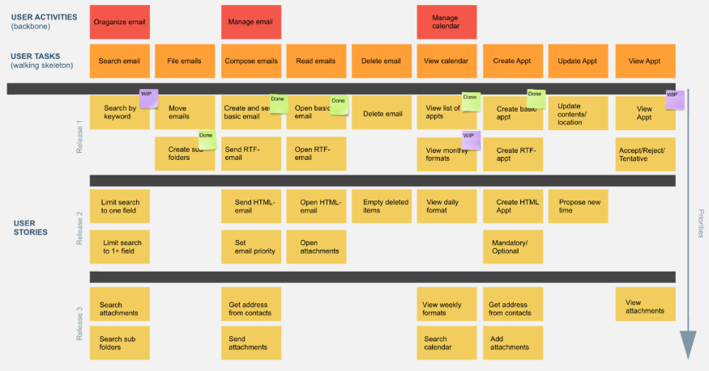

# Basics of Agile Planning.

There are two main planning parts in any agile project.

1. Release planning.
     
    The product vision is shared with the development team to make sure everyone is on the same page. Then create a plan to deliver value in a defined date.

    Important tasks during release planning:
     
    - Establish project goals.
    - Create user stories.
    - Prioritize stories.
    - Estimate stories.
    - Group stories.
    - Set a release date.

2. Iteration planning

    Define specific goals for the next iteration.

    Important tasts:

    - Confirm stories for the next sprint.
    - Decompose stories into tasks.
    - Refine estimates.
    - Update requirements.

## Defining the Project Scope.

The scope is the amount of work that needs to be done to consider the project done. Scope increases during the time of development.

Project owners get to decide if new features stay or not, in order to keep the scope in control while at the same time delivering the maximum value to the customer. 

> ***Scope Creep:*** When the scope goes beyond the original bound. Longer projects are more prone to this.

## Some important tools.

- ### Use cases

    Describes a sequence of actions that provide value to an actor
    > An ***actor*** represents anything that interacts with the system, be it *a person, an organization or an external system*.

- ### Personas

    Define or represent archetypes of users of the system. These help understand how users might interact with a system in a more *personal* way. 
    Each persona is composed by:

    - Name
    - Personality
    - Motivation
    - Profesional details.
    - Picture

    > A persona represents an actual person. Don't make up personas.

- ### Wireframes

    Wireframes are a visual guide, define information hierarchy, are easier to design and help understand features or stories in a high level representation, thus preventing attachment to design or visual features and instead focusing on structure, layout and an overall representation of functionality.

    - Should be low fidelity.
    - Allow to experiment.
    - Can include annotations.
    - Provide explanation with each wireframe.

    > Wireframes shouldn't be more than boxes inside other boxes. Less is more... kinda...

## Story Maps

Story maps help to define releases and prioritize user stories in a visual way. Thus allowing to easily pick up important features for each release.

