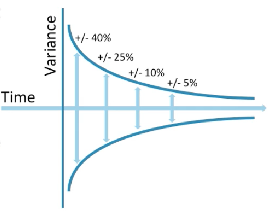

# Estimating the agile way.

Since the agile approach is to welcome chage, chances are that the first estimates for any feature in an agile project will be far from the actuals.

> ***Progressive Elaboration:*** A project in agile is consstantñy modificated and improved. It evolves.

This constant change and uncertainty of estimates leads to the concept of ***The cone of uncertainty***. The uncertainty of estimates reduces over time, since our knowledge about the team's capacity is bigger and we are  more confident of the estimates.

