# Data structures
In CS a data structuree is a wat to srore organize andd manage information in a wat that allows you to easily access or modify the values in them in an efficient way, each accomplishes this in a different manner.

## Efficiency
### BigO notation
Is a wat to score a data structure based on 4 criteria, based on their hability to: 
- Access the data in it
- Search for an element
- Insert an element
- Remove an element

All of these categories are scored using a BigO Time Complexity Equation. we always use the worst-case scenario

# Basic data structures / Random Access Data Structures
RADS: Each element is independent of the one before or after it, and can be accessed immediatly by just referencing the index of the element.

## The Array
An array is fundamentally a list of similar values. every item in the array is refered as an element of the array. Has 3 attributes:
- Name
- Type
- Size

> #### Parallel arrays
> Two or more arrays that contain the same number of elements and have corresponding elements in the same position.

The type of the array is the typo of the information thaat is stored within the array. **ALL** of the information stored in the array has to be of **the same type**

The array's size is fixed and **cannot be changed.** 

> This might feel counter intuitive, but this is for a reason.

#### There are two ways two create an array
- By populating the asrray with all it's elements
- By specifying it's size and populating the array later on as the program runs.

_Populated arrays in java and python_
``` java
int array[] = {1,2,3};
```
```py
my_array = [1, 2, 3]
```

_Array in java with only its size_
```java
int array[] = new int[10]
```
> There's no example for python because there's no conventional way of creaitng an empty array without using more complex data sources or packages.

To access an element in an array we use a numerica index, which is an integer that corresponds to an element within the array, it starts at 0.

> #### Two dimentional arrays
> Is an array with an array at each index.

### The array as a data structure

- **Accesing** O(1)
  This is why array sizes cannot be changed in order for this to be true

- **Searching** O(n)
  Since the array will probably be unsorted, we will need to check each element in order to find what you're looking for. There are faster ways to search in an array but they need the data to be sorted

- **Inserting** O(n)
  To insert anything in an array we need to shift every element thats after the index you want to insert the value to the right one space.

- **Deleting** O(n)
  Mostly the same idea of the insertion but now we need to shift the elements after the index we are deleting to the left

#### Pros
- Good for sotoring similar contiguous data
- O(1) for accesing
- Very basic, easy to learn

#### Cons
- Size cannot be changed
- Inserting and deleting are not efficient
- Can be a waste of space since there might be empty spaces

## The ArrayList
Can be fundamentally tought as a growing array. An arraylist is backed by an array in memory. That means a lot of the functionallity will be the same.

#### Initializing arraylists
```java
ArrayLsit<Integer> arrayList = new ArrayList<Integer>();
```
 
Arraylists can be initialized with a seize but cannot be initialized by populating them with elements. Arraylists can only sort objects.

> Again there's no python example included, this is because in python arrays and arraylists are combined in Lists, which have some functionality of each 

An araylist is overall an evolved form an array. Since this belongs to the class ArrayList it has pre-buiñt functions that are at our disposal and that we can use to access, change or delete the data inside them. This method will change depending on the language. The 6 more common methods of the arraylist are: 

- Add
  - `Add(Object)` - This will simply appends the element at the end of the arraylist
  - `Add(Object, index)` - This will append the element in the index you pass, this will automatically shift the elements at the right of the specified index
- Remove
  - `Remove(Index)` - Removes the element at the specified index
  - `Remove(Object)` - Removes the first instance of the object passed into the arrayList
- Get
  Pretty much the same as referencing an index of an array
- Set - Takes an index and sets the element specified in the index specified.
- Clear - Clears the whole Array
- toArray - Return an array, really usefull to combine the strengths and weaknesess of arrays and arraylists

### The ArrayList as a data structure

- **Accesing** O(1)
  Instead of storing the actual elements asossiated with the elements index, the arraylist stores pointers to the spot in memory where the element in such index is stored. So while the data is not store contiguously the references are.

- **Searching** O(n)
  We also need to search through each and every item of the arraylist.

- **Inserting** O(n)
  Just like with the array

- **Deleting** O(n)
  Just like with the array

#### Why even use an array if the arraylist is so usefull?
While the array lists is more powerfull it still has some drawbacks, like only being able to store objects or being more heavy in memory because it is a class.

# Intermediate data structures / Sequential Access Data Structures
SADS: Each element is dependend of the others and can only be accessed in a particular order. Also called Limited Access Data Structures or LADS lol.

## The Stack
Is a data structure in which we add elements and remove elements according to the **Lifo Principle** (Last In Firs Out)

The two main methods to interact with the stack:
- Push
  Pushes an object on to the top of the stack, takes an object to push and returns no value.
- Pop
  Remove an element from the top of the stack, doesn't take any arguments and returns the removed element.

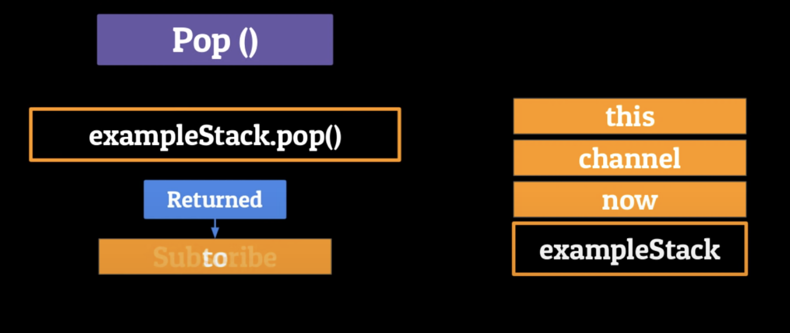

This next two methods are used to interact with the data in the stack without changing it
- Peek
  Can be used to know what the data in the last element of the stack without removing it.
- Contains
  Can be used to search for an element without modifying the elements in the stack

### Time complexity of the stack

- **Accesing** O(n)
  Worst case scenario if the element we want is at the begging of the stack we would need to take every other element to access it.

- **Searching** O(n)
  Will be also O(n) for the same exact reason.

- **Inserting** O(1)
  Since the data only flows in an out inserting is just one operation.

- **Deleting** O(1)
  Since the data only flows in an out deleting is just one operation.

The most common use of stacks in CS is in recursion. In the real world we can find them in undo-redo buttons and back-paging.

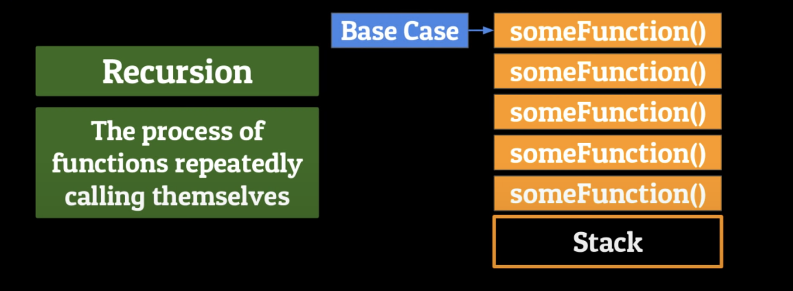

## The Queue
A queue is a sequential data structure that follows the **FIFO principle** (First In First Out). The later you show up, the longer you have to wait.

In contrast to the stack, instead of adding elements to the top, we add them to the end or the _tail_ and we remove them from the top or _head_.

Basic methods of the queue:
- Enqueue(Object)
  Adds one element to the tail of the queue.

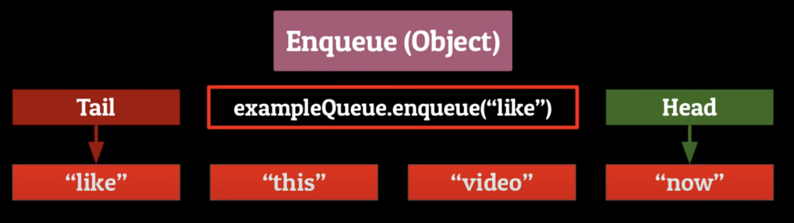

- Dequeue
  Takes no arguments and returns the removed element.

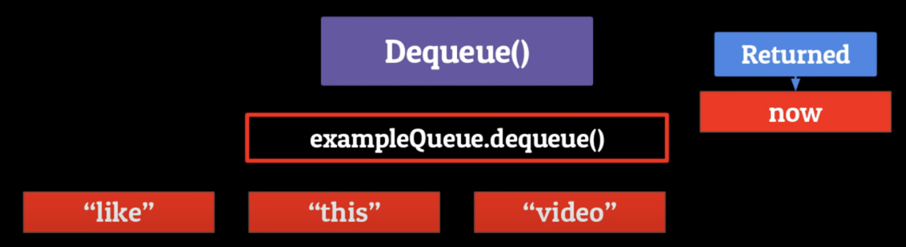

Other basic methods also in queue
- Peek
  Lets you peek at the head of the queue without removing it.
- Contains
  Takes an object and returns a boolean of wether or not the queue contains that object

### Time complexity of the queue

- **Accesing** O(n)
  Worst case scenario if the element we want is at the head of the queue we would need to take away every other element to access it.

- **Searching** O(n)
  Will be also O(n) for the exact same reason.

- **Inserting** O(1)
  Since the data only flowsin one way inserting is just one operation.

- **Deleting** O(1)
  Since the data only flows one way deleting is just one operation.

The most common use of stacks in CS is in recursion. In the real world we can find them in undo-redo buttons and back-paging.

> The queue and the stack are like a Jing-Jang type of deal

Some common uses of the queue are 
- job-scheduling is the process in which the computers determine which task s to complete for the user and when
- In printers
- Modern smartphone cameras

## The Linked-List
A linked list is a sequential access linear data-structure in which every element is a separate object called a **node** which has two parts

- The data
- The reference (or pointer) which points to the next node in the list

The first node is called the **head node** and the last the **tail node**, this tail node points to null since its the end of the list

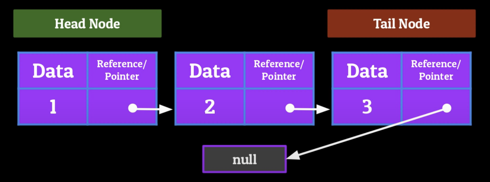

When using a linked list we can easily add and remove elements from the head, middle or tail of the linked list, all of this is going to revolve around the pointers in the nodes of the linkedlist

- Adding and removing from the **head**
  To add a new node to the head, make that new node's pointer point to the head of the linked list or to remove the head set that node's pointer to null.
  No other node has changed

- Adding and removing nodes to the **middle** of the linked list
  - Adding
  First make the pointer of the new node point to the node after the location we want to insert at, then set the node before the location we want to insert at to point towards the new node.
  - Removing
  Just make the node previous to the one we're removing point to the one we're removing, then set the pointer we want to remove = to a null value

- Inserting and Removing from the **tail** of the list
  To add a node to the tail just point the last node of the list towards the new node and the new node point to null. To remove just make the node before the tail point towards null.

### Time complexity of the LinkedList

- **Accesing** O(n)
  Linked lists are SADS so we need to traverse the whole list to get to the worst case scenario

- **Searching** O(n)
  Will be also O(n) for the exact same reason.

- **Inserting** O(n) or O(1) 
  Since the LinkedList only stores the location of the head and tail, inserting at the beginning or end of the list will be O(1) but for inserting in the middle we need to traverse the list and then insert, which is O(n)

- **Deleting** O(n) or O(1)
  Same as inserting

Linked lists can be used in the backing of other data structures (We can use the LL to make Stacks, Queues, etc...)

#### One big drawback
We can only traverse the linked list forward, so once we get to a certain node, there's no way of going back

## Doubly linked list
As well as the simple LL a Doubly Linked List is a sequential access linear data-structure which stores data in the form of nodes, only this time we are able to traverse both forwards and backwards using pointers.

Just as with the regular LL every DLL will start with a Head Node, if the head node is the only node, both pointer will point towards a null value.

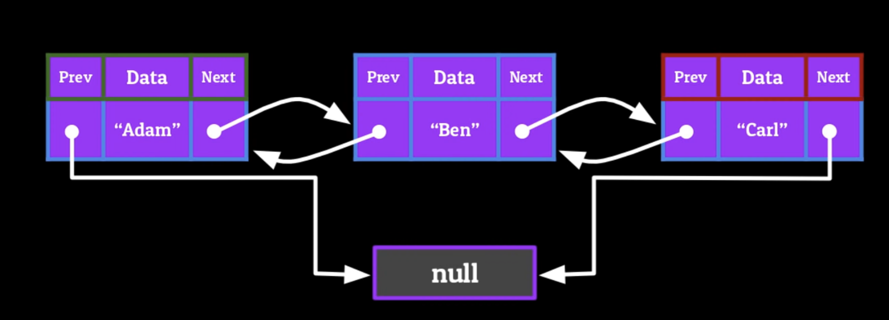

Now when adding nodes to the list we need to take care of two nodes instead of just one.

- Adding and removing from the **head**
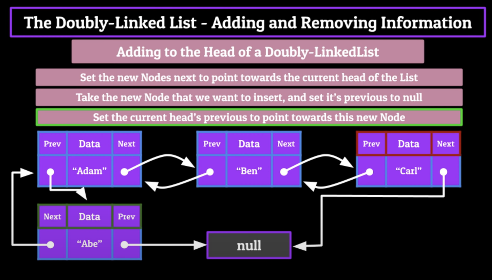

- Adding and removing from the **middle**
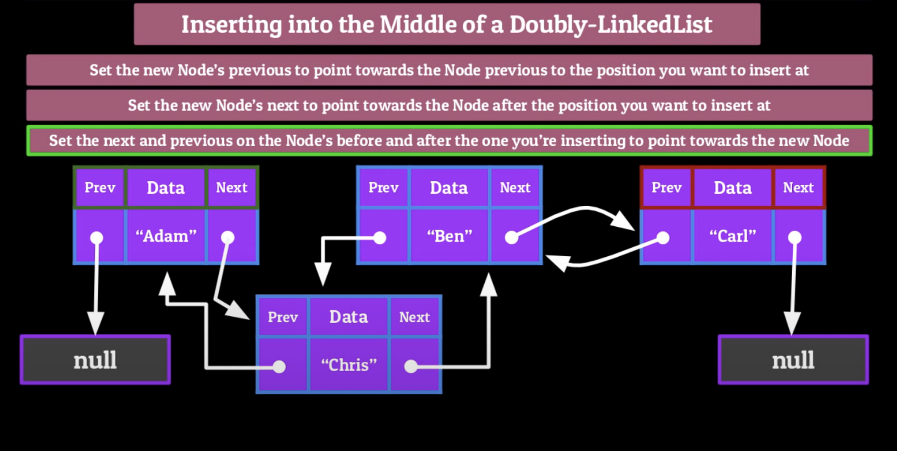

- Adding and removing from the **tail**
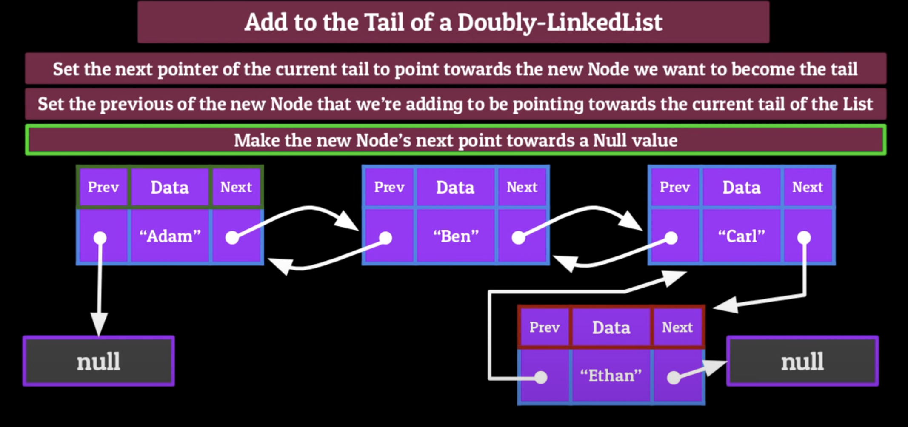


> The most important part when adding or removing nodes is that the flow of the list remains constant without any breaks on the pointer.s.

### Time complexity of the DoublyLinkedList

Same as the Linked List

Uses for a double linked list can be implementedin a lot of stack-like functionality, like undo redo, open recents, anything where you want to be able to travel back and forth.

# Dictionaries
One of the most abstract data structures. Also referred as **Maps** and **Associative Arrays**.

Stores data in the form of **Key/Value pairs**

The Keys and Values in a dict can be pretty much any primitive data type you can think of.

There are two extremely important restrictions for dictionaries:
- Every key can only appear **once** within the dictionary
- Every key can only have **one value**

> There can be duplicates of values within a dictionar

### Time complexity of the Dictionary


- **Accesing** O(1)  
- **Searching** O(1)  
- **Inserting** O(1)
- **Deleting** O(1)

Thanks to the use of hash tables the dictionary on average will have a time complexity of O(1)

# Tree-Based data structures
From here on we will drop our discussion about time complexity because its difficult to calculate given the compexities of the following data structures.

Instead of storing data in a linear fashion, tree based data structures store data in a hierarchical way, like in a family tree or a file structure system.

A tree is an abstract Data Structure which contains a series of linked nodes connected together to form a hierarchical representation of information. 

Like a linkedList where each node has the options of pointing towards multiple nodes

Each of the nodes in a tree are also called vertices and the connections between verticees are called edges.

### Tree terminology and Visualization

- **Vertive**: A certain node in a tree
- **Edge**: A connection between node
- **Root node**: Topmost Node of a Tree
- **Child node**: A certain node which has an edge connecting it to anther Node one level above itself
- **Parent Node**: Any Node which has 1 or more child nodes
- **Leaf Node**: A Node in a tree which doesn't have any child nodes
- **Height**: _Property of the Tree_ Number of edges on the longest possible path down towards a leaf
- **Depth**: _Property of a Node_ Number of edges required to get from that particular node to the root Node

> By impossing rules and restrictionas on what type of data and where is it stored in the tree we can heighten the power of the trees.


## Binary Search Trees

Simple variation on the regular tree with three restrictions on it to help organize the data.

- A Node can have at most 2 children
- For any given parent node, the child to the left has a value less than or equal to itself, and the hild to the right has a value greater than or equeal to itself.
- No two Nodes can contain the same value.

The biggest advantage of this type of tree is that we're able to search trough it in Logarithmic Time. This makes them great for storing large quantities of data that need to be easily searchable, which also translates to accessing, inserting and deleting Nodes.

## Tries

This is another variation of the regular tree with some restrictions. Specifically is a tree-like data structure that sotres letters of an alphabet in the form of characters.

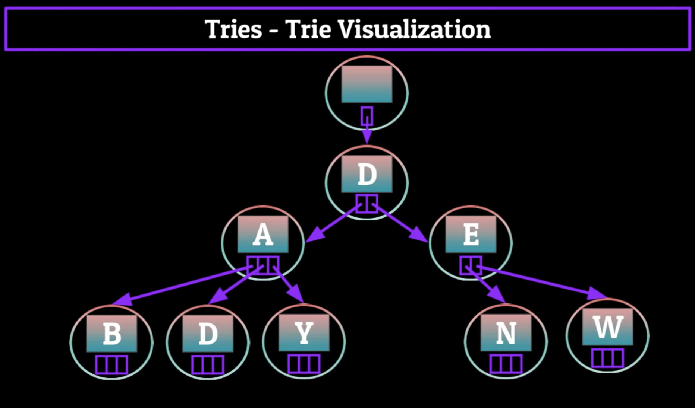

We can carefully construct this three of characters in such a way which allows us to quickly retrieve words in the form of Strings by traversing down a path of the trie in a certain way.

In a trie the root node has a Null value and contains an array of references to other nodes of words that start with each of those nodes values.

Each node has references that point towards all characters in the English alphabet which serve as the first two characters of a word in the English dictionary.

As we travel down different paths of our trie we can build words.

But how do we know when a word has ended, for example if we want to retrieve the word Den, which is in a path that includes the word Denver, how do we know when to stop?.

#### Flagging
We mark the end of the word by having it also point towards a flag to let the computer know that the end of a word has ocurred.

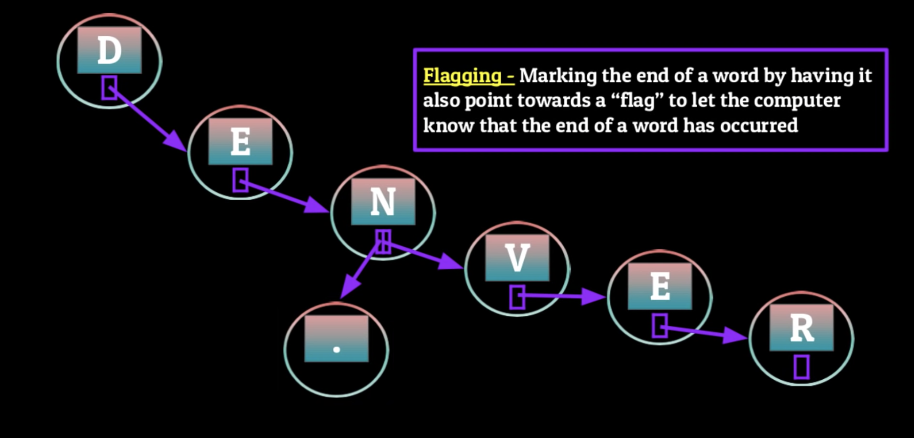

#### General use cases of a trie.

Autocomplete features on phone keyboards or spell checks on Docs.

When you have to store the entire dictionary its much better to use a trie because you will eliminate many options with each letter you type.

## Heaps
A heap is a special kind of binary tree where all parent Nodes compare to their children nodes in some specific way by being more or less extreme. Either greater than or less than

- **MinHeaps**: 
  - The value at the root Node must be the minimum amongst all of its children.
  - This fact must be the same recursively for all parent Nodes contained within the heap
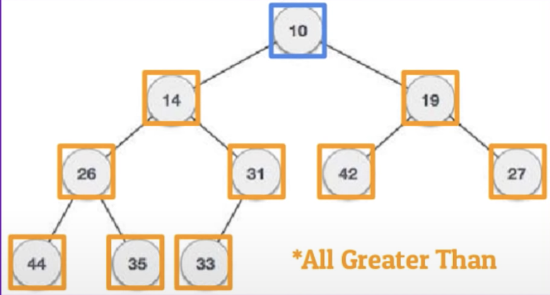


- **MaxHeaps**:
  - The value at the root Node must be the maximum amongst all of its children.
  - This fact must be the same recursively for all parent Nodes contained within the heap
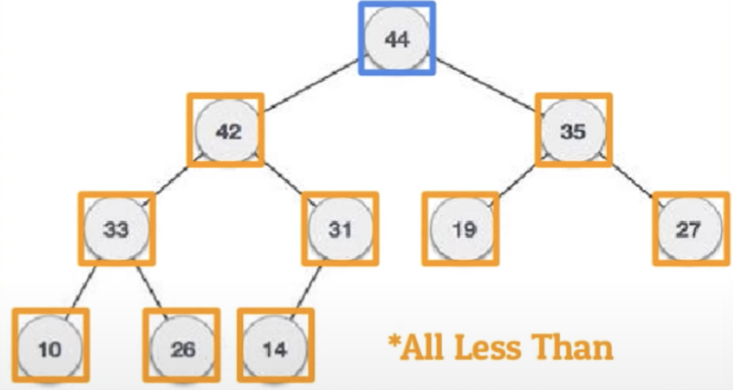

When data is stored in a heap, it makes it extremely easy to insert data.

When inserting data to a heap, first we insert the new value in a new node to the leftmost position in the tree. Then we compare recursively to it's parent node and swap if necessary.

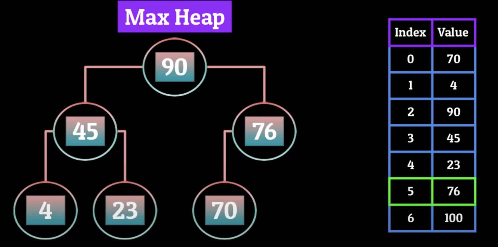

### Removing the Root node from the heap

1. Remove the root node from our heap
2. Replace it with the node furthest to the right
3. "Heapify" the Heap by comparing parent nodes to their children (Starting from the root node) and swapping them if necessary

### Uses of heaps

- **HeapSort**: Heaps are very usefull in the implementation of HeapSort. A sorting algorithm which takes a list of elements, builds them into a min or max heap and then removes the root Node continuously to make a sorted list.
- **Priority Queues**: The way that the computer uses to know when to do a task.

## Graphs
Graphs contain Pieces of information and the paths that run between them.
Nonlinear structures consisisting of Nodes and Edges.
- Finite set of Nodes (Vertices)
- Nodes are connected by the edges

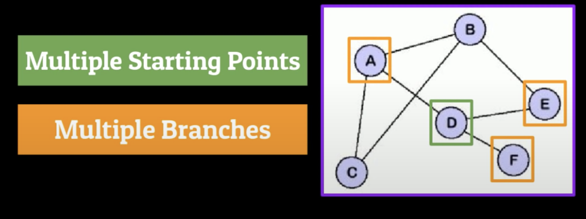

- **Directed**: A graph in which the direction uyou traverse the Nodes is important, usually indicated by arrows representing direction.
- **Undireceted**: A graph in which the direction uyou traverse the Nodes is unimportant
- **Cyclic**: Contains a path from at least one Node back to itself. Theoretically all undirected graphs are cyclical, since each path goes both ways it automatically creates a cycle.
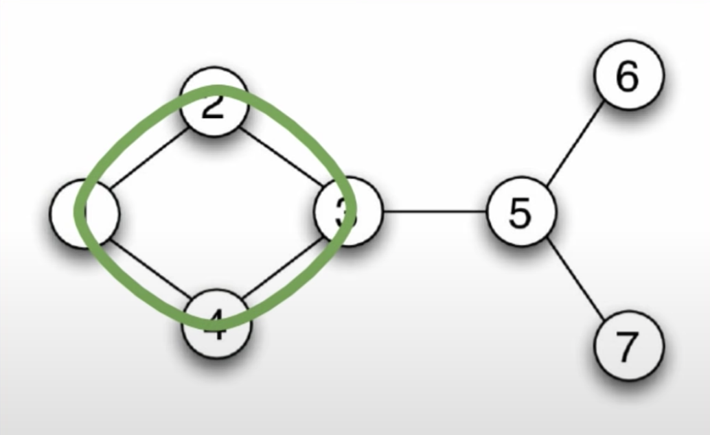
- **Acyclic**: No path from any node which leads back on itself. Can only apply to directed graphs.
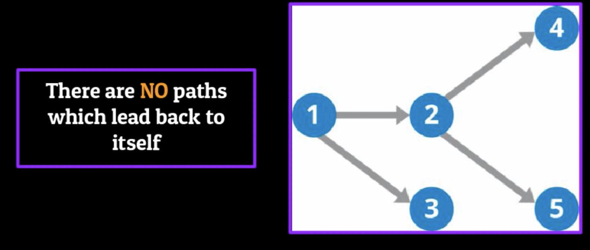
- **Weighted Graphs**:
  - Associating a numerical value with each edge (Cost)
  - Each weight represents some property of the imformation you're trying to convey

### Common types of graphs

- **Undirected Cyclical Heaps with weighted Edges**
  Can be used through the Dijkstra's shortes path algorithn.
  Compiles a list of the shwortest possible paths from that source vertex to all other Nodes withing the Graph
  - Google maps
  - Ip routing systems
  - Phone systems

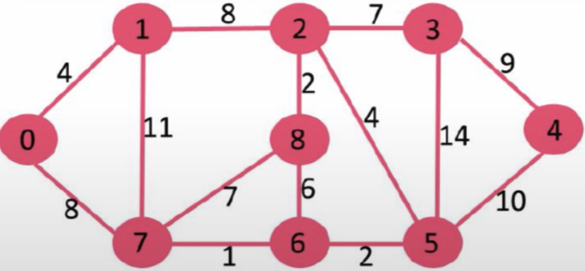

- **Unweighted Cyclical Graphs (Undirected and Directed)**
  Used in the follower system of a majority of social media websites
  - Facebook
  - Twitter
  - Tiktok
  - Instagram


  
