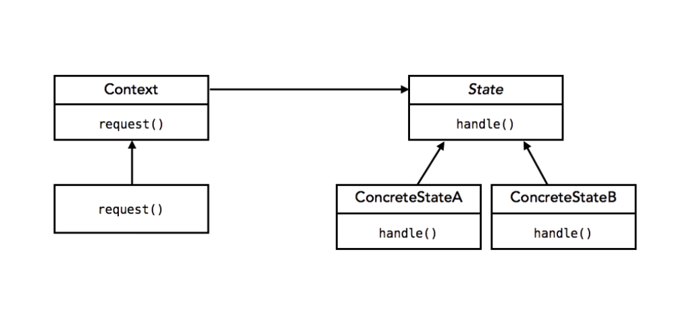

# Notes from the Course Programming Foundations: Design Patterns at [Lynda](https://lynda.com)

## *By using design patterns you are not reusing code, you are reusing **experience*** 

# Design Principles. 
## 1. *Encapsulate wath varies.*
Begin by identifying the parts of the code that may need to change in the future.

## 2. *Program to an interface, not an implementation.*
Try to stay away from specific implementations, make the code as generic as possible.

## 3. *Favor composition over inheritance.*
Most of the time composition leads to a more flexible and open to change design and to less mantainability issues.

## 4. *Strive for loosely coupled designs between objects that interact.*
This helps to design flexibility since any change in either side of the relationship won't be likely to break that relationhsip, the looser the objects are coupled, the lesser the probability for that breakup :)

## 5. *Open for extension, Closed to modification.*
This is one of the most important principles in software development, it refers to current objects, they should be open for the implementation of new features, however that new implementation should not interfere with current code that already works.

## 6. *Single responsibility*
A class should only have one reason to change. Therefore the impact of change in the specifications won't be that hard. Seems like this one will lead to further flexibility and minimized maintainabilty efforts, however might also mean a lot of awful code.h


# Design Patterns.

## 1. The Strategy Pattern.
Prefer composition over inheritance, instead of passing behavior down to subclasses, use special interfaces for each piece of behavior and define specific behaviors as implementations of that interface, then in the Main class of the whole thing define instance variables for each behavior type, and assign that specific behavior your subclasses. 

## 2. The Observer Pattern.
Use this pattern if some object needs to notify other objects when it changes and pass it's data to the notified objects. 

Implement an isntance variable that holds a **list of Observers** in your **Observable** object; 

Add a `update(Observable o, Object data)` method to each **Observer**, this will be called by the **Observable** each time the data changes.

> The `Observable o` parameter is optional, use it in case the Observer keeps track of more than one Observable.  
> The `Object data` parameter is also optional in case you want to directly pass the new data to the Observable when it get's notified of changes.
 
Add these three methods to the **Observable**: 

- `registerObserver(Observer o)` to add an observer to the list.
- `removeObserver(Observer o)` to remove an observer from the list.
- `notifiObservers()` **iterate over the Observers** list and call the update method on each of them, optionally you can pass the new state of the Observable.

> There are a couple of helpers in java that'll help you with this pattern; The Observable class and the Observer interface.

## 3. The Decorator Pattern.
This pattern allows to add functionality without touching old funcitonal code, by spliting some implementation in a structure of abstract classes that shar the Supe Class with the objects to which we want to add the new funcitonality.

This pattern is better explained with a class diagram.


Now each `ConcreteComponent` instance can be wrapped in an undefined number of decorators and still be fully functional.

``` java
Component component = new ConcreteComponent();

// Because each decorator receives a Component type object there's no issue with passing an already decorated object, this is really powerful         
component = new ConcreteDecorator1(component);
component = new ConcreteDecorator2(component);
```

## 4. The Singleton Pattern.
A singleton refers to an instance of a special kind of class, the class is special because it ensures that there exists only one instance of itself at any point during execution.

This is accomplished by ensuring that the class keeps track of it's single instance and by protecting the constructor so the class can manage how and when its instance gets created.

``` java
public class Singleton {
    private static Singleton uniqueInstance; // <- this static var will hold the instance once created  
    
    // By making the constructor private we protect the isntantiation of the class.
    private Singleton() {}

    // Public method, accessible from any other object.
    private static Singleton getInstance () {
        if (uniqueInstance == null) {
            uniqueInstance = new Singleton();
        }
        return uniqueInstance;
    }

    // Some code, actual class implementation.
}
```

However this implementation is not perfect. In case of a multithreaded execution, two threads might access the getInstance method at the same time and create two instances of the Singleton class, this can be prevented in two different ways.

- Instatiate the new Singleton at the time the class is defined.

    ``` java
    public class Singleton {
        private static Singleton uniqueInsance = new Singleton();

        private Singleton() {}

        public static getInstance() {
            // No need to create instance again.
            return uniqueInstance;
    // ...
    ```

    The caviat of this implementation is the fact that the uniqueInstance is no longer lazy instantiated, this means that the instance will be createdd even if it is never used in the program.

- Use the synchronized word in the getInstance method definition.

    ``` java
    // ...
    
    public static synchronized getInstance() {
        // ...

    ```

    The caviat of this code is that using the synchrinized keyword its expensive in the way that it takes longer than unsynchronized code to run, and this will not only affect the time the Singleton gets instantiated but every time the program calls the `getInstance` method.

## The State Pattern.

In the state pattern the funcitonality of a object that needs to change it's state and behavior based on that state gets a visit from composition, in order to delegate those behavior changes into specific state objects that are then owned by the State machinge.

Diagram:



This way all the behaviors are delegated to the Concrete state subclassses, which intern decide what to do given each behavior.

This pattern shouldn't be confused with the strategy pattern, even though the diagrams and structure of both patterns are alike, **both have different intents.** This is a very important remark to make when talking about design patterns. 

For a design pattern is not only the general structure of the code or the Class Diagram that matters, nor the implementation, but it is also very important to take a look at what the intent of the Pattern is, what problem is trying to solve, and ho.

Below there's a small example of how to implement this pattern.

State.java

``` java
public interface State {
    public void action1();
    public void action2();
    //...
}
```

AConcreteState.java

```java
public class ConcreteSatate implementes State () {
    StateMachine stateMachine;

    public ConcreteState (StateMachine stateMachine) {
        this.stateMachine = StateMachine;
    }

    public void action1() {
        stateMachine.setState(stateMachine.getAnotherState());
    }

    public void action2() {
        System.out.println("This action is not performable in this state");
    }
}
```

AnotherConcreteState.java

```java
public class AnotherConcreteState implements State {
    StateMachine stateMachine;

    public AnotherConcreteState(StateMachine stateMachine) {
        this.stateMachine = stateMachine;
    }

    public void action1() {
        System.out.println("This action is not performable in this state");
    }

    public void action2() {
        stateMachine.setState(stateMachin.getAState());
    }
}
```
     
StateMachine.java

```java
public class StateMachine {
    private AState aState;
    private AnotherState anotherState;
    private State state;

    public StateMachine() {
        aState = new AState(this);
        AnotherState = new AnotherState(this);
    }

    // this method triggers action1, making this machine change its state
    public methodTrigger1() {
        ... Some functionality
        // whichever the state, the action will be performed.
        state.action1();
    }

    public methodTrigger2() {
        // Again the action gets called
        state.action2();
        ... functionality
    }
}
```

## The Iterator Pattern.
If an object holds a collection of items, create an implementation of the Iterator interface and return that implementation to the objects that might need to iterate over the first objects collection.

Diagram:


## The Factory Method Pattern.
Delegating the functionality of instantiating objects to a separate class allows you to further compose your code, this goes along with several principles of Design patterns, like the single responsibility.


